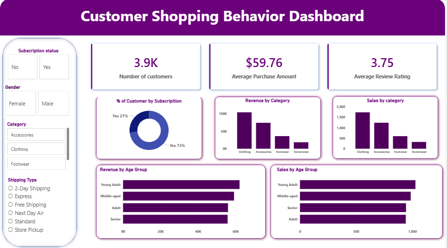

# Customer Shopping Behavior Analysis

## Overview
This project analyzes customer shopping behavior using Python, PostgreSQL, and Power BI. The workflow includes data loading, exploratory data analysis (EDA), data cleaning, SQL analysis, dashboard creation, and reporting to generate meaningful business insights.

---

## Dataset
The dataset contains customer shopping information, including:
- Customer Demographics
- Product Categories
- Purchase Amount
- Subscription Status
- Review Ratings
- Age Groups
- Shipping Types

---

## Tools & Technologies
- Python
- Jupyter Notebook
- Pandas
- NumPy
- PostgreSQL
- SQL
- Power BI
- Microsoft PowerPoint

---

## Project Workflow

### 1. Data Loading
- Imported dataset into Python.
- Loaded data using Pandas.

### 2. Exploratory Data Analysis (EDA)
- Checked dataset structure.
- Identified missing values.
- Generated descriptive statistics.
- Explored customer behavior patterns.

### 3. Data Cleaning
- Removed duplicates.
- Handled missing values.
- Corrected data types.
- Prepared clean data for analysis.

### 4. SQL Analysis
- Imported cleaned dataset into PostgreSQL.
- Executed SQL queries for business insights.
- Used:
  - SELECT
  - WHERE
  - GROUP BY
  - ORDER BY
  - Aggregate Functions

### 5. Power BI Dashboard
Created an interactive dashboard to visualize:
- Total Customers
- Average Purchase Amount
- Average Review Rating
- Revenue by Category
- Sales by Category
- Revenue by Age Group
- Sales by Age Group
- Customer Subscription Distribution

### 6. Report & Presentation
- Prepared a project report.
- Created a PowerPoint presentation summarizing the analysis and findings.

---

## Dashboard Preview

---

## Key Results
- Identified top-performing product categories.
- Compared revenue across age groups.
- Analyzed customer subscription behavior.
- Evaluated average customer ratings.
- Generated actionable business insights through SQL and Power BI.

---

## Project Files

- `Customer_Behavior_Analysis_Dashboard.pbix`
- `customer_behavior_python.ipynb`
- `Customer_behavior_sql_queries.sql`
- `customer_shopping_behavior.csv`
- `Dashboard.PNG`
- `Customer_shopping_behavior_ppt

---

---

## Business Insights
This project demonstrates an end-to-end data analytics workflow, combining Python for data preparation, PostgreSQL for querying, and Power BI for interactive visualization to support data-driven decision-making.

---

## Author

**Govind Gupta**

Aspiring Data Analyst

Skills:
- SQL
- Python
- Power BI
- Excel
- PostgreSQL
- Data Visualization
